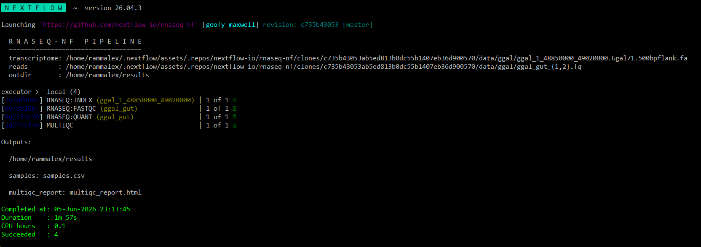
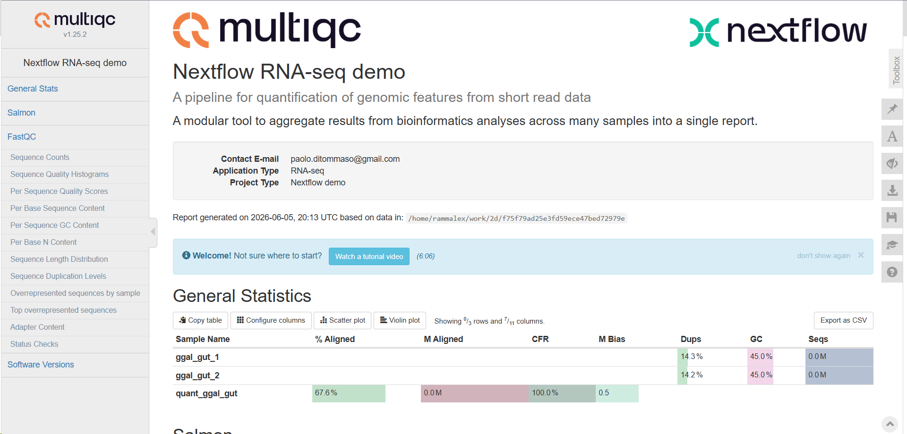
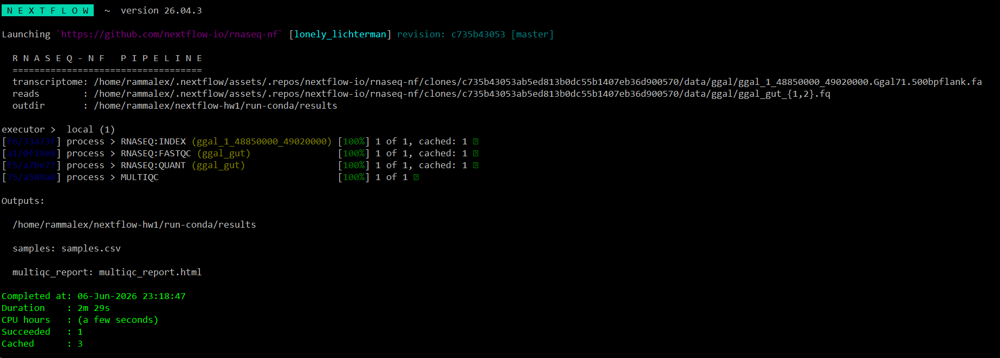
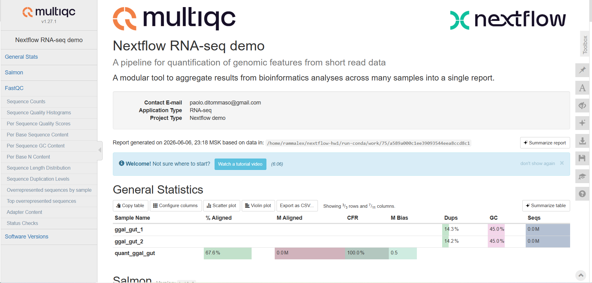
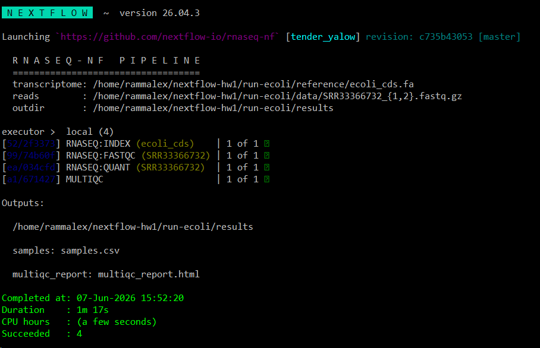
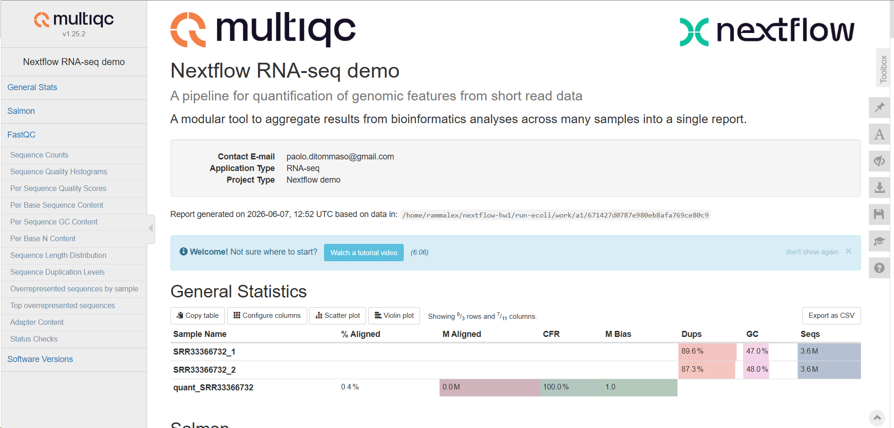

# Homework 1 — Running Nextflow pipelines
## 1. Environment setup
The pipeline was executed on Ubuntu with these tools:
- Nextflow 26.04.3
- OpenJDK 25
- Docker 29.1.3
- Conda 26.5.0

## 2. Running the pipeline on test data
The `nextflow-io/rnaseq-nf` pipeline ships with small test data (chicken
*Ggal* reads and transcriptome). Two profiles were tested.
### 2.1 Getting the rnaseq-nf pipeline
The pipeline was pre-fetched before running to verify connectivity.
```bash
nextflow pull nextflow-io/rnaseq-nf
```
### 2.2 Docker profile
```bash
nextflow run nextflow-io/rnaseq-nf -profile docker
```

*Figure 1. Pipeline execution with the `docker` profile on the test data.*

*Figure 2. MultiQC summary report after the `docker` profile run on test data.*
### 2.3 Conda profile
```bash
nextflow run nextflow-io/rnaseq-nf -profile conda
```

*Figure 3. Pipeline execution with the `conda` profile on the test data.*

*Figure 4. MultiQC summary report after the `conda` profile run on test data.*

## 3. Running the pipeline on a real dataset
### 3.1 Dataset description (E. coli SRR33366732)
A small bacterial RNA-seq run was selected from NCBI SRA:
- **Run accession:** SRR33366732
- **Organism:** *Escherichia coli* K-12 MG1655
- **Library strategy:** RIP-Seq (RNA immunoprecipitation sequencing)
- **Layout:** Paired-end
- **Spots / reads:** 3,647,650 / 7,295,300
### 3.2 Downloading FASTQ files
```bash
prefetch SRR33366732
fasterq-dump --split-files --threads 2 --mem 1GB SRR33366732
gzip SRR33366732_1.fastq SRR33366732_2.fastq
```
Parameters of `fasterq-dump` were tuned to fit WSL2 resource limits after the default fasterq-dump invocation crashed the system during the join phase.
### 3.3 Downloading the reference transcriptome
```bash
wget https://ftp.ncbi.nlm.nih.gov/genomes/all/GCF/000/005/845/GCF_000005845.2_ASM584v2/GCF_000005845.2_ASM584v2_cds_from_genomic.fna.gz
gunzip GCF_000005845.2_ASM584v2_cds_from_genomic.fna.gz
mv GCF_000005845.2_ASM584v2_cds_from_genomic.fna ecoli_cds.fa
```
### 3.4 Pipeline execution
```bash
nextflow run nextflow-io/rnaseq-nf -profile docker --reads "$PWD/data/SRR33366732_{1,2}.fastq.gz" --transcriptome "$PWD/reference/ecoli_cds.fa" --outdir "$PWD/results"
```

*Figure 5. Pipeline execution on the real E. coli SRR33366732 dataset using the `docker` profile.*

*Figure 6. MultiQC summary report on the E. coli dataset.*

